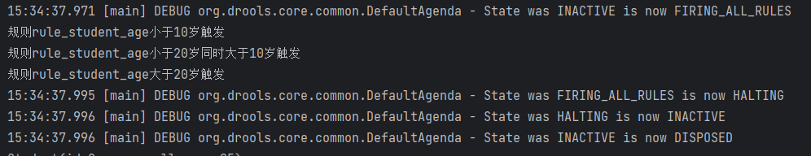

Drools组成和入门 https://easen.blog.csdn.net/article/details/134739000

Drools基础语法 https://easen.blog.csdn.net/article/details/134739436

入门分支： dev-1.0.0

 测试比较操作符 ： dev-1.0.1

## update 方法 

分支：dev-update

org.example.TestDemo1#test5

