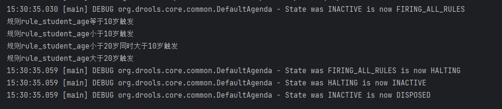
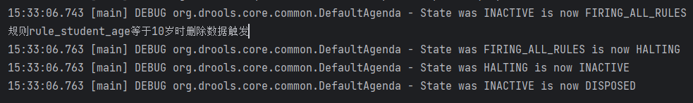
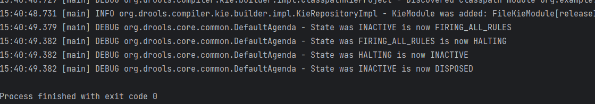
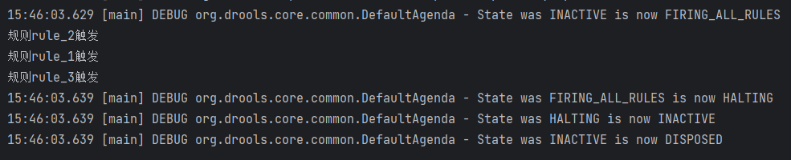
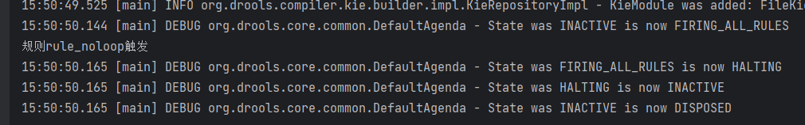
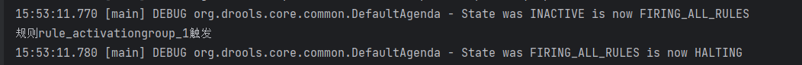
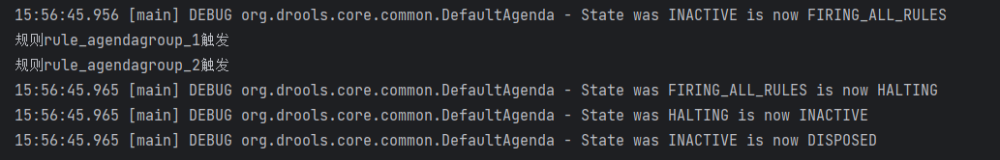
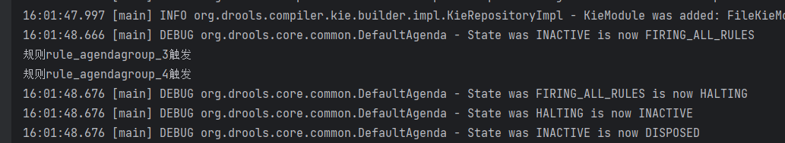

Drools组成和入门 https://easen.blog.csdn.net/article/details/134739000

Drools基础语法 https://easen.blog.csdn.net/article/details/134739436

入门分支： dev-1.0.0

 测试比较操作符 ： dev-1.0.1

## update 方法 

分支：dev-update

org.example.TestDemo1#test5

## insert 方法

分支： dev-insert

org.example.TestDemo1#test6

## retract 方法

分支： dev-retract

org.example.TestDemo1#test7

## enabled 属性

分支： attributes-enabled

org.example.TestDemo1#test8

## salience 属性

分支： attributes-salience

org.example.TestDemo1#test9

## no-loop 属性

分支： attributes-no-loop

org.example.TestDemo1#test10

## activation-group 属性

分支： attributes-activation-group

org.example.TestDemo1#test11

## agenda-group 属性

分支： attributes-agenda-group

org.example.TestDemo1#test12

## auto-focus 属性

分支： attributes-auto-focus

org.example.TestDemo1#test13

